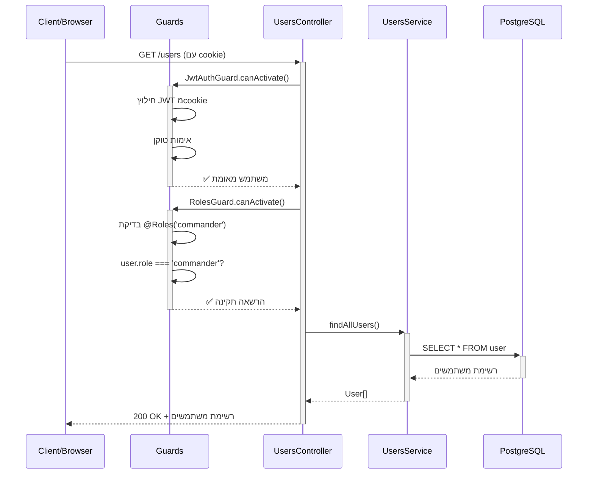

# 🛡️ מערכת ניהול שמירות צבאיות

פרויקט NestJS למערכת ניהול משמרות במסגרת צבאית עם מערכת הגנה ובקרת גישה.

## 🎯 מטרת הפרויקט

מערכת המאפשרת:
- **למפקדים:** יצירת משמרות והקצאת חיילים
- **לחיילים:** צפייה במשמרות שלהם בלבד
- **אבטחה:** בקרת גישה לפי תפקיד עם JWT

---

## 💻 טכנולוגיות בשימוש

| טכנולוגיה | תיאור | גרסה |
|-----------|--------|-------|
| **NestJS** | Framework לשרת Node.js | 11.x |
| **TypeORM** | ORM למסד נתונים | 0.3.x |
| **PostgreSQL** | מסד נתונים יחסי (Neon Cloud) | - |
| **JWT** | אסימוני אימות | @nestjs/jwt |
| **Passport** | מערכת אימות | passport-jwt |
| **bcrypt** | הצפנת סיסמאות | 6.x |
| **class-validator** | וולידציה של נתונים | 0.14.x |
| **Cookie Parser** | ניהול cookies | 1.4.x |

---

## 📁 מבנה הפרויקט

```
src/
├── main.ts                    # נקודת כניסה
├── app.module.ts              # מודול ראשי
├── app.controller.ts          # בקר בסיסי
├── app.service.ts             # שירות בסיסי
│
├── auth/                      # מודול אימות
│   ├── guards/               # שומרי הגישה
│   ├── decorators/           # דקורטורים מותאמים
│   ├── auth.module.ts
│   ├── auth.controller.ts
│   ├── auth.service.ts
│   └── dto/
│
├── users/                     # מודול משתמשים
│   ├── users.module.ts
│   ├── users.controller.ts
│   ├── users.service.ts
│   ├── user.entity.ts
│   ├── hashPassword.ts
│   └── dto/
│
├── shifts/                    # מודול משמרות (בפיתוח)
└── assignments/               # מודול הקצאות (טרם פותח)
```

---

## 📊 פירוט קבצים ופונקציות

### 🔐 **Auth Module**

#### `auth.controller.ts`
| Route | Method | פונקציה | מקבל | מחזיר |
|-------|--------|----------|------|--------|
| `/auth/login` | POST | `userAuth()` | `auteLoginDto` | JWT בcookie + הצלחה |
| `/auth/validate` | POST | `validateToken()` | `{token: string}` | פרטי משתמש |

#### `auth.service.ts`
| פונקציה | פרמטרים | מחזיר | תיאור |
|----------|----------|--------|-------|
| `bringHashCodeFromDB()` | `auteLoginDto` | `string` | שליפת hash סיסמה |
| `comparePasswords()` | `dto, hash` | `boolean` | השוואת סיסמאות |
| `generatToken()` | `auteLoginDto` | `{token, user}` | יצירת JWT |
| `validateToken()` | `token: string` | `payload` | וולידציית טוקן |

#### `guards/jwt.guard.ts`
| פונקציה | פרמטרים | מחזיר | תיאור |
|----------|----------|--------|-------|
| `canActivate()` | `ExecutionContext` | `boolean` | בדיקת JWT מcookie |

#### `guards/roles.guard.ts`
| פונקציה | פרמטרים | מחזיר | תיאור |
|----------|----------|--------|-------|
| `canActivate()` | `ExecutionContext` | `boolean` | בדיקת הרשאות תפקיד |

#### `jwt.strategy.ts`
| פונקציה | פרמטרים | מחזיר | תיאור |
|----------|----------|--------|-------|
| `validate()` | `payload: any` | `user object` | פענוח JWT לפרטי משתמש |

---

### 👥 **Users Module**

#### `users.controller.ts`
| Route | Method | פונקציה | מקבל | מחזיר | הגנה |
|-------|--------|----------|------|--------|-------|
| `/users` | GET | `getAllUsers()` | - | `User[]` | מפקדים בלבד |
| `/users` | POST | `createNewUser()` | `CreateUserDto` | `User` | מפקדים בלבד |
| `/users/:id` | GET | `getUserById()` | `id` | `User` | - |
| `/users/:id` | DELETE | `deleteUserById()` | `id` | הודעה | מפקדים בלבד |

#### `users.service.ts`
| פונקציה | פרמטרים | מחזיר | תיאור |
|----------|----------|--------|-------|
| `findAllUsers()` | - | `User[]` | כל המשתמשים |
| `createUser()` | `CreateUserDto` | `User` | יצירת משתמש חדש |
| `findUserById()` | `id: number` | `User` | משתמש לפי ID |
| `deleteUser()` | `id: number` | הודעה | מחיקת משתמש |

#### `user.entity.ts` - מבנה הטבלה
```typescript
- id: number (PK, Auto)
- userName: string
- role: string ('commander' | 'soldier')
- passwordHash: string
- createdAt: Date
```

---

## 🔄 דוגמת זרימה: "מפקד רוצה לראות את כל המשתמשים"



### **במקרה של חייל שמנסה לגשת:**
```
Client → Guards → RolesGuard: user.role = 'soldier' ❌
← 403 Forbidden
```

---

## 🚀 הרצת הפרויקט

```bash
# התקנת תלויות
npm install

# הרצה במצב פיתוח
npm run start:dev

# השרת יעלה על: http://localhost:3000
```

---

## 🔒 מערכת האבטחה

### **JWT Token Structure:**
```json
{
  "username": "דוד כהן",
  "id": 1,
  "role": "commander",
  "iat": 1234567890,
  "exp": 1234654290
}
```

### **רמות הרשאה:**
- **Commander:** גישה מלאה לכל הפעולות
- **Soldier:** צפייה במידע אישי בלבד

---

## 📈 סטטוס פיתוח

- ✅ **מערכת אימות** - JWT + Guards
- ✅ **ניהול משתמשים** - CRUD מוגן
- 🚧 **ניהול משמרות** - בפיתוח
- ⏳ **מערכת הקצאות** - בתכנון

---

## 🛠️ מה הלאה?

1. השלמת מודול Shifts
2. יצירת מודול Assignments 
3. הוספת ממשק משתמש (Frontend)
4. בדיקות אוטומטיות